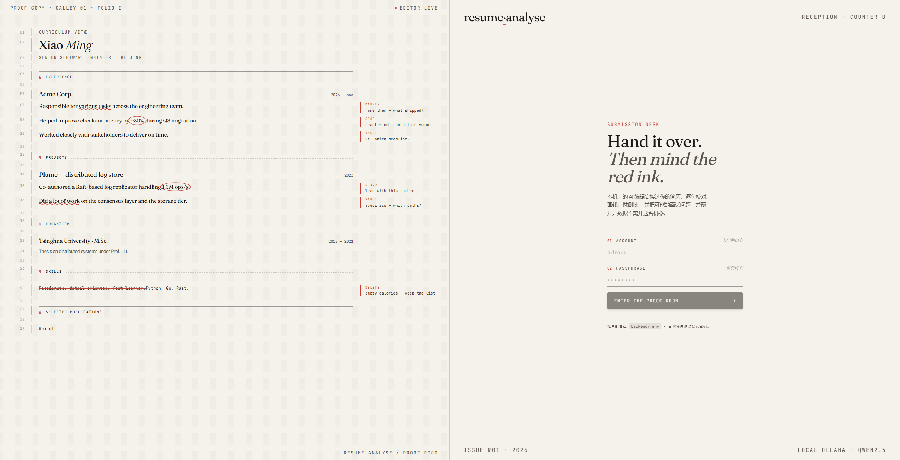
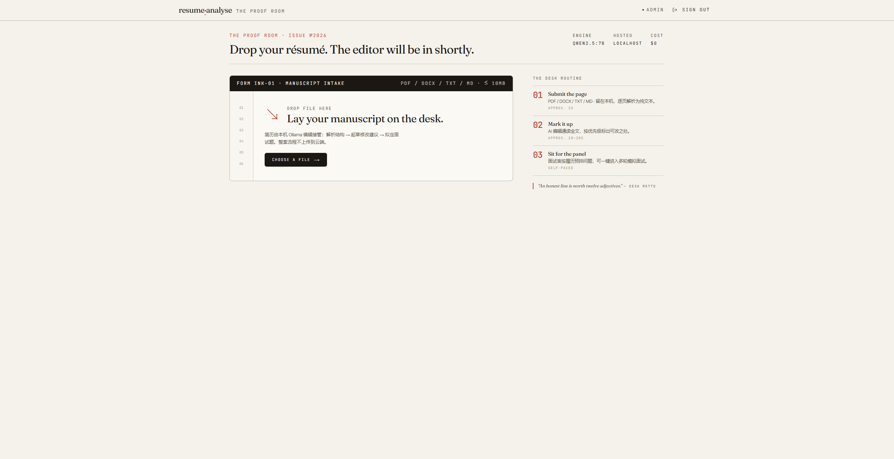
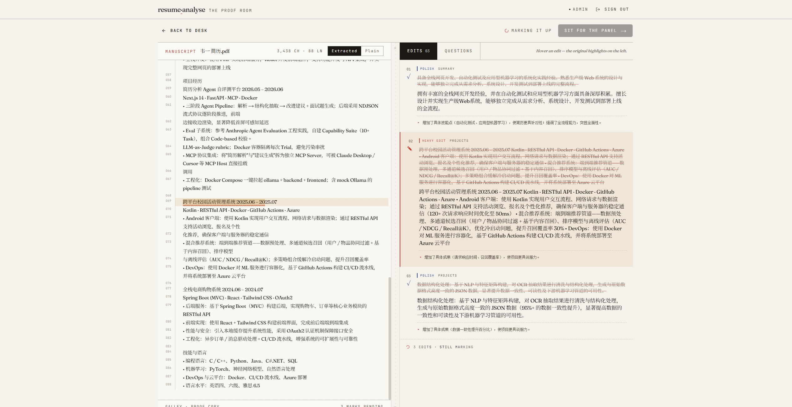

# resume-analyse

> 智能简历分析 + 模拟面试网页 — 上传简历后，由本地大模型给出**改进建议**、**面试题预测**，并支持**多轮模拟面试 + 评估报告**。数据全程不离开你的机器。

```
┌───────────────────────────────┐    ┌───────────────────────┐    ┌────────────────────┐
│  Next.js 14 + Tailwind +      │ ↔  │  FastAPI (Python 3.11+)│ ↔ │  Ollama (本地模型)  │
│  shadcn/ui  (frontend/)       │    │  (backend/)           │    │  qwen2.5:7b 等      │
└───────────────────────────────┘    └───────────────────────┘    └────────────────────┘
```

## 功能特性

三个核心页面：登录 → 上传 → 分析（含模拟面试入口）。

### 登录页



50/50 布局。左半屏是一份正在被实时校对的简历样张：AI 编辑逐句打字，再用红色波浪线、红色椭圆圈、琥珀高亮、删除线四种 mark 配上 margin note 标注，把产品要做的事直接演示给你看。右半屏是极简登录表单。

### 上传页



落地后第一屏就是 drop-zone，拖拽或点击上传 PDF / DOCX / TXT / MD，最大 10 MB。右栏列出整个流程的三步编号 01 / 02 / 03，让用户对接下来要发生的事有预期。

- **拖拽上传**：四种格式自动解析为纯文本（PDF 用 pypdf，DOCX 用 python-docx）
- **数据不出机**：文件交给本机 Ollama 解析，不上传到云端
- **解析容错**：PDF 单页解析失败软降级，保住其余页

### 分析页



50/50 联动：左侧是带行号的简历原稿预览，右侧是 `Edits` / `Questions` 两个 tab。

- **结构化抽取**：先把简历变成 JSON（教育 / 工作 / 项目 / 技能）
- **改进建议**（Edits）：按优先级（heavy edit / polish / tidy）输出原文 → 建议 → 改写理由；hover 一条建议时左侧原稿自动滚到对应行并高亮
- **面试题预测**（Questions）：按难度（warm-up / on the record / defend it）分组，附答题提示
- **流式渲染**：后端用 NDJSON 逐条推送，前端边出边渲染，不用等齐
- **抗幻觉**：token-Jaccard grounding 校验 + 强约束提示词，丢弃简历中找不到原文的建议

### 模拟面试

分析完成后点右上角 **Sit for the panel**，选题数（3 / 5 / 8 / 10）和难度（cordial / probing / adversarial），进入多轮面试。

- **简历驱动出题**：基于简历真实内容生成 3-10 道主问题，每题预绑定 2 道追问
- **逐题流式评分**：提交答案后立即开始评估，分数动画 + 反馈 + 参考答案
- **综合评估报告**：综评分数、分类得分、优势 / 改进 双栏建议
- **会话状态机**：`generating → ready → in_progress → completed → evaluated`，刷新页面可恢复
- **隐私优先**：通过 Ollama 调用本地模型，简历不出本机

## 致谢与参考

模拟面试 Agent 的设计借鉴了 [Snailclimb/interview-guide](https://github.com/Snailclimb/interview-guide)（Java + Spring Boot 实现）。我们参考了它的几条核心思路并适配到 Python + 本地 7B 模型：

- **题目预生成 + 追问预绑定**：一次性出题，每题挂 2 道追问，避免边答边生成的卡顿
- **`topic_summary` 历史去重**：每题带 ≤10 字摘要，重出时回灌防止重复
- **逐题打分 + 二次汇总评估**：把"评单题"和"看全局"拆开，避免长上下文让小模型失忆
- **「不知道 / 跳过 / 不会」必须 0 分**：防止 7B 模型给放弃作答打人情分
- **"严禁编造简历中不存在的项目"**：硬约束写进 system prompt

不同点：interview-guide 是企业级方案（Spring Boot + PostgreSQL + Redis + 语音 ASR/TTS）；本项目是单机 MVP（FastAPI + 进程内存 + 纯文本），定位不同。

---

## 目录结构

```
resume-analyse/
├── backend/                    # FastAPI 后端 + Agent
│   ├── app/
│   │   ├── api/
│   │   │   ├── health.py
│   │   │   ├── resume.py
│   │   │   ├── analysis.py            # 简历分析（含 NDJSON 流式 /full）
│   │   │   └── interview_session.py   # 模拟面试（5 个端点，3 个流式）
│   │   ├── agent/
│   │   │   ├── ollama_client.py       # AsyncClient 封装 + 流式
│   │   │   ├── pipeline.py            # 简历分析两步流水线 + 流式 JSON 解析器
│   │   │   ├── prompts.py             # 简历分析提示词
│   │   │   ├── interview_agent.py     # 面试 agent：出题 / 评分 / 出报告
│   │   │   ├── interview_prompts.py   # 面试 agent 提示词
│   │   │   └── schemas.py
│   │   ├── services/
│   │   │   ├── parser.py              # PDF / DOCX / TXT / MD 解析
│   │   │   ├── grounding.py           # token-Jaccard 抗幻觉校验
│   │   │   └── storage.py             # 进程内 store（resume + analysis + session）
│   │   └── schemas/
│   │       ├── resume.py
│   │       ├── analysis.py
│   │       └── interview_session.py
│   └── tests/                          # 25 个单元测试，全过
├── frontend/                   # Next.js 14 (App Router) 前端
│   ├── app/
│   │   ├── page.tsx                    # 上传页
│   │   ├── analyze/[id]/page.tsx       # 简历分析结果页
│   │   └── interview/[sessionId]/page.tsx  # 模拟面试页
│   ├── components/
│   │   ├── ui/*                        # shadcn/ui 基础组件
│   │   ├── ResumeUploader.tsx
│   │   ├── SuggestionCard.tsx
│   │   ├── InterviewQuestionList.tsx
│   │   ├── AnalysisSkeleton.tsx
│   │   ├── QuestionSidebar.tsx         # 面试侧边题目列表
│   │   ├── AnswerFeedback.tsx          # 答题反馈（动画分数 + 折叠参考答案）
│   │   └── InterviewReport.tsx         # 面试综合报告
│   └── lib/api.ts                      # 类型化 API 封装 + NDJSON 流式 helper
├── start.sh / stop.sh          # Git Bash 一键启停脚本
└── docker-compose.yml          # 一键拉起 ollama + backend + frontend
```

---

## 整体架构

### 数据流

```
用户上传简历 ─▶ /api/resume/upload ─▶ ParsedResume 存入 store
                                                │
                                                ▼
              ┌────────────────────────────────────────────────────────┐
              │                   两条独立的 Agent 链路                 │
              ├──────────────────────────┬─────────────────────────────┤
              │  ① 简历分析             │  ② 模拟面试                 │
              │                          │                             │
              │  POST /api/analysis/.../ │  POST /api/interview-       │
              │       full (NDJSON 流式)│       session/start         │
              │                          │                             │
              │  extract → suggestions   │  generate questions         │
              │  → interview questions   │       │                     │
              │  逐条 yield 给前端        │       ▼                     │
              │                          │  POST .../{sid}/answer ────┐│
              │                          │  evaluate (per question)   ││
              │                          │       │                    ││
              │                          │       ▼  循环作答          ││
              │                          │  POST .../{sid}/finish ────┘│
              │                          │  generate report (流式)     │
              └──────────────────────────┴─────────────────────────────┘
```

---

## API 速览

### 简历相关

| 方法 | 路径 | 说明 |
|---|---|---|
| GET  | `/health` | 进程健康 |
| GET  | `/health/ollama` | Ollama 可达性与模型清单 |
| POST | `/api/resume/upload` | `multipart/form-data` 上传简历，返回 `resume_id` |
| GET  | `/api/resume/{id}` | 取回解析后的纯文本 |
| POST | `/api/analysis/{id}/suggestions` | 同步返回改进建议 |
| POST | `/api/analysis/{id}/interview-questions` | 同步返回面试题 |
| POST | `/api/analysis/{id}/full` | NDJSON 流式返回全部分析事件 |

### 模拟面试相关

| 方法 | 路径 | 说明 |
|---|---|---|
| POST   | `/api/interview-session/start` | **流式**：创建会话 + 逐条推送预生成的题目 |
| GET    | `/api/interview-session/{sid}` | 取完整会话状态（页面刷新恢复用） |
| POST   | `/api/interview-session/{sid}/answer` | **流式**：评估单题 + 推送下一题 |
| POST   | `/api/interview-session/{sid}/finish` | **流式**：生成综合报告（综评 / 优势 / 改进 / 分类得分） |
| DELETE | `/api/interview-session/{sid}` | 删除会话 |

完整 Swagger UI：<http://localhost:8000/docs>

#### NDJSON 事件协议

`/api/analysis/{id}/full`：

```
{"stage": "extract:start"}
{"stage": "extract:done"}
{"stage": "suggestions:start"}
{"stage": "suggestion:item",   "data": SuggestionItem}    ← 重复
{"stage": "suggestions:done",  "data": SuggestionsResult}
{"stage": "interview:start"}
{"stage": "interview:item",    "data": InterviewQuestion} ← 重复
{"stage": "interview:done",    "data": InterviewQuestionsResult}
{"stage": "all:done"}
{"stage": "error", "message": "..."}                       ← 任何阶段出错
```

`/api/interview-session/start`：

```
{"event": "session:created",  "data": InterviewSession}     ← 立即可跳转
{"event": "question:item",    "data": InterviewQuestion}    ← 重复
{"event": "questions:done",   "data": InterviewSession}
```

`/api/interview-session/{sid}/answer`：

```
{"event": "eval:start"}
{"event": "eval:done",        "data": Answer}
{"event": "next:question",    "data": InterviewQuestion | null}
{"event": "session:complete"}                                ← 全部答完时
```

`/api/interview-session/{sid}/finish`：

```
{"event": "report:overall",      "data": {"overall_score", "overall_feedback"}}
{"event": "report:strength",     "data": "<one strength>"}     ← 重复
{"event": "report:improvement",  "data": "<one improvement>"}  ← 重复
{"event": "report:category",     "data": CategoryScore}        ← 重复
{"event": "report:done",         "data": InterviewReport}
```

---

## Windows 本地启动教程（推荐）

> 本节是这台机器上**已验证可跑通**的步骤，包括 NVIDIA GPU 加速、Python 3.14、pnpm 等实战中会踩的坑。Linux/macOS 用户参考最下方的"通用启动"小节。

### 0. 环境要求

| 工具 | 最低版本 | 实测版本 | 备注 |
|---|---|---|---|
| Windows | 10/11 | Windows 11 | — |
| Python | 3.11 | 3.14.5 也能跑 | 3.14 上所有依赖都有预编译 wheel |
| Node.js | 18+ | 24.16.0 | — |
| pnpm | 任意 | 11.5.3 | `npm install -g pnpm` |
| Ollama | 0.5.4+ | 0.30.7 | RTX 50 系（Blackwell）需要 ≥ 0.5.4 |
| NVIDIA 驱动 | 较新即可 | 596.49 | 可选，但强烈建议有 GPU |

### 1. 安装 Ollama

去 <https://ollama.com/download/windows> 下载安装包，双击安装。安装完成后：

- Ollama 服务会**自动后台启动**（监听 `localhost:11434`）
- `ollama` 命令会自动加到 PATH
- 验证：在新开的 PowerShell / Git Bash 里运行 `ollama --version`

### 2. 选择并拉取模型

模型选择参考（按显存大小）：

| 显存 | 推荐模型 | 大小 | 中文表现 |
|---|---|---|---|
| 8 GB（如 RTX 5060/4060/3070） | **qwen2.5:7b** ⭐ | 4.7 GB | 优秀 |
| 12 GB（如 RTX 4070/3080） | qwen2.5:14b | 9 GB | 更优秀 |
| 16+ GB | qwen2.5:14b 或 qwen2.5:32b | 9 / 20 GB | — |
| 无独显（纯 CPU） | qwen2.5:7b | 4.7 GB | 可用，速度慢 |

> ⚠️ **不要超出显存大小**：14b 在 8 GB 卡上会溢出到 CPU，反而比 7b 慢得多。

```powershell
# 拉模型（约 4.7 GB，根据网速 2~5 分钟）
ollama pull qwen2.5:7b

# 验证模型可用
ollama list
```

### 3. 准备配置文件

```powershell
# 在项目根目录
cd D:\PythonProject\resume-analyse

# 后端配置
copy backend\.env.example backend\.env

# 前端配置
copy frontend\.env.local.example frontend\.env.local
```

默认配置已经能直接用，**无需修改**。如果 Ollama 不在本机或要换模型，再编辑 `backend\.env` 中的 `OLLAMA_HOST` / `OLLAMA_MODEL`。

### 4. 安装并启动后端

```powershell
cd D:\PythonProject\resume-analyse\backend

# 创建虚拟环境（用 .venv 隔离，避免污染全局 Python）
python -m venv .venv

# 安装依赖（包括开发依赖：pytest / ruff / mypy）
.venv\Scripts\python.exe -m pip install --upgrade pip
.venv\Scripts\python.exe -m pip install -e ".[dev]"

# 跑一下测试，确认环境完好（应输出 25 passed）
.venv\Scripts\python.exe -m pytest -q

# 启动开发服务器
.venv\Scripts\python.exe -m uvicorn app.main:app --reload --port 8000
```

启动成功的标志：终端打印 `Uvicorn running on http://127.0.0.1:8000`。

**自检接口**（另开一个终端）：

```powershell
# 后端进程存活
curl http://127.0.0.1:8000/health
# {"status":"ok"}

# Ollama 可达 + 模型清单
curl http://127.0.0.1:8000/health/ollama
# {"status":"ok","host":"http://localhost:11434","model":"qwen2.5:7b","available_models":["qwen2.5:7b"]}
```

如果 `/health/ollama` 返回 `unreachable`，先去 Ollama 那一步排错——**这个接口不通的话，整套分析流水线都不会工作**。

### 5. 安装并启动前端

```powershell
cd D:\PythonProject\resume-analyse\frontend

pnpm install

# ⚠️ 关键一步：批准 unrs-resolver 的构建脚本，否则 pnpm dev 会失败
pnpm approve-builds --all

# 启动开发服务器
pnpm dev
```

启动成功的标志：终端打印 `✓ Ready in X.Xs` 和 `Local: http://localhost:3000`。

> **为什么要 `pnpm approve-builds`**：Next.js 的依赖 `unrs-resolver` 有原生构建脚本，pnpm 默认会忽略并报告 `[ERR_PNPM_IGNORED_BUILDS]`；下次 `pnpm dev` 启动前的依赖一致性检查会因此报错并退出。批准一次即可，配置写入 `node_modules/.modules.yaml`。

### 6. 验证全链路

打开浏览器访问 **http://localhost:3000**，拖一份简历上去：

1. 跳到 `/analyze/{id}` 页面，看着流式分析一段段冒出来
2. 分析完成后，点击右上角 **"开始模拟面试"** → 选择题数和难度 → 进入面试
3. 答题 → 看分数动画 + 反馈 → 下一题 → 全部答完后生成综合报告

如果想确认 GPU 真的被用上了，发起分析后另开终端：

```powershell
nvidia-smi --query-gpu=name,memory.used,memory.total --format=csv
# 应该看到 7000+ MiB 显存被占用，进程列表里会有 llama-server.exe
```

---

## 日常启动（每次重启电脑后）

### 推荐：一键脚本（在 Git Bash 里跑）

项目根目录有 `start.sh` 和 `stop.sh`，**用 Git Bash 打开它所在目录**：

```bash
./start.sh    # 启动
./stop.sh     # 强制停止（仅在 Ctrl+C 没清干净时用）
```

`start.sh` 做了哪些事：
1. 强制 kill 8000 / 3000 端口上的旧进程（解决 Next.js 漂到 3001 那个坑）
2. 检查 Ollama 是否在跑
3. 后台启动后端，等 `/health` 返回 200 才继续
4. 前台启动前端，**日志直接打在你这个终端里**
5. 浏览器自动打开 http://localhost:3000

**停止：直接 `Ctrl+C`** —— 前端立即停，脚本的 EXIT trap 会顺手把后端也清掉。

后端日志写在 `.logs/backend.log`，分析失败时去这里看堆栈。

> **为什么不直接 `pnpm dev`**：3000 端口被占时，Next.js 会偷偷漂到 3001，但后端 `CORS_ORIGINS` 只允许 3000，分析就会失败。脚本会先强制清理端口，避免这个坑。

### 手动启动

如果不用脚本，分别开两个终端：

```powershell
# 终端 1：后端
cd D:\PythonProject\resume-analyse\backend
.venv\Scripts\python.exe -m uvicorn app.main:app --reload --port 8000

# 终端 2：前端
cd D:\PythonProject\resume-analyse\frontend
pnpm exec next dev -p 3000
```

> 用 `pnpm exec next dev -p 3000` 而不是 `pnpm dev`：显式指定端口，被占就硬报错，绝不漂到 3001。

Ollama 服务在 Windows 上是开机自动启动的，不需要手动起。如果发现 `/health/ollama` 不通，去任务栏托盘里看 Ollama 图标是否在跑，或在终端里执行 `ollama serve` 手动启动。

---

## 通用启动（Linux / macOS / Docker）

### Linux / macOS

```bash
# 0. Ollama
ollama serve &
ollama pull qwen2.5:7b

# 1. 后端
cd backend
cp .env.example .env
python -m venv .venv && source .venv/bin/activate
pip install -e ".[dev]"          # 或：uv sync（推荐）
uvicorn app.main:app --reload --port 8000

# 2. 前端
cd frontend
cp .env.local.example .env.local
pnpm install
pnpm approve-builds --all
pnpm dev
```

### Docker 一键启动

```bash
cp .env.example .env
docker compose up --build
# 还需进入 ollama 容器拉模型：
docker exec -it resume-analyse-ollama ollama pull qwen2.5:7b
```

---

## 测试

```powershell
cd backend
.venv\Scripts\python.exe -m pytest -q   # 25 个测试，全部用 mock Ollama，无需真实模型
```

测试覆盖范围：
- `test_agent.py` — 简历分析两步流水线
- `test_grounding.py` — token-Jaccard 抗幻觉
- `test_parser.py` — PDF / DOCX / TXT 解析
- `test_streaming.py` — 流式 JSON 增量解析器
- `test_interview_agent.py` — 面试 agent 三阶段（出题 / 评分 / 报告）

---

## 配置项

后端 `backend/.env`：

| 变量 | 默认 | 说明 |
|---|---|---|
| `OLLAMA_HOST` | `http://localhost:11434` | Ollama 服务地址 |
| `OLLAMA_MODEL` | `qwen2.5:7b` | 使用的模型（改这里要先 `ollama pull` 对应模型，再重启后端） |
| `OLLAMA_TIMEOUT` | `120` | 单次调用超时（秒） |
| `CORS_ORIGINS` | `http://localhost:3000` | 允许的前端来源（逗号分隔） |
| `MAX_UPLOAD_MB` | `10` | 上传文件大小上限 |

前端 `frontend/.env.local`：

| 变量 | 默认 | 说明 |
|---|---|---|
| `NEXT_PUBLIC_API_BASE_URL` | `http://localhost:8000` | 后端 API 地址 |

> ⚠️ 后端配置是 `@lru_cache` 缓存的——**改了 `.env` 必须重启 uvicorn 才会生效**。

---

## 常见问题

### Ollama 相关

**`/health/ollama` 返回 `unreachable`**

- 先在终端执行 `ollama list` 看 Ollama 进程是否在跑
- 任务栏托盘里看是否有 Ollama 图标；没有的话执行 `ollama serve`
- 如果你改过 `OLLAMA_HOST`，确认地址和端口对得上

**模型加载到了 CPU 而不是 GPU**

- 显存不够：换更小的模型（如从 14b 换成 7b）
- Ollama 版本太旧：RTX 50 系（Blackwell）需要 0.5.4+，重新去官网下载升级
- 在分析进行中执行 `nvidia-smi`，进程列表里没有 `llama-server.exe`，说明走的是 CPU

**首次分析很慢，第二次就快了**

- 正常现象。第一次调用包含模型从硬盘加载到显存的时间（约 30~60 秒）；后续调用模型常驻，只跑推理。

### Python 相关

**`pip install` 报错"找不到 wheel"或编译失败**

- 多半是 Python 版本太老（< 3.11）。pyproject.toml 要求 `>=3.11`
- 也可能是太新的版本（如 3.14）暂时还没编译——本项目实测 3.14.5 上所有依赖都有 wheel，但更新的版本就不一定了

**`uvicorn` 启动报"端口被占用"**

- 上次的进程没退干净。Windows 下：`netstat -ano | findstr :8000` 找到 PID，然后 `taskkill /PID <pid> /F`
- 或者直接用 `./stop.sh`

### 前端相关

**`pnpm dev` 一启动就退出，报 `[ERR_PNPM_IGNORED_BUILDS]`**

- 见上文第 5 步：执行 `pnpm approve-builds --all`

**前端能打开但分析转圈不动**

- 浏览器开 DevTools → Network，看 `/api/analysis/.../full` 这个请求的 NDJSON 流是否在持续返回事件
- 如果 `error` 事件携带 "Agent failure"，去后端终端看完整堆栈

**面试页报 "Session not found"**

- 服务重启过 → 内存里的 session 丢了。回到分析页重新点"开始模拟面试"即可
- 这是 MVP 已知行为，路线图里 PostgreSQL 是替换目标

### 数据持久化

**重启服务后简历找不到了**

- 这是已知行为：MVP 版本所有数据（简历、分析缓存、面试会话）都在进程内存里（见 `backend/app/services/storage.py`），重启即丢
- 路线图里 PostgreSQL 是替换目标，需要持久化时再做

---

## 路线图（不在 MVP 内）

- 用户系统、登录鉴权
- 数据持久化（PostgreSQL + 历史记录）
- JD 输入 → 岗位匹配度评分
- 面试 agent 加 critic 二次校验，根治"在真实句子里塞数字"这种精细幻觉
- 多语言简历自动识别
- 导出分析 / 面试报告 PDF

## 许可

MIT
